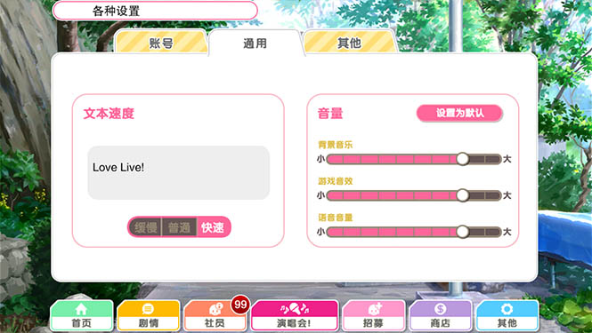

# LLSIF-autoplay

My personal "Love Live! School Idol Festival" auto play hacks

这是我自用的手游Lovelive! School Idol Festival自动打歌插件, 它过去四年至今几乎无修改在各服务器各版本的LLSIF里正常工作, 且从未被封号, 现开源代码仅供参考

## 功能

- 所有模式自动打歌
- 游戏内自由切换
    1. 图中"文本速度 - 快速"对应以Fullcombo自动打歌, perfect率预设95%
    2. "文本速度 - 普通"对应以非Fullcombo自动打歌, good率预设0.5%
    3. "文本速度 - 慢速"对应关闭插件功能

## 使用

通常你需要知道如何编译和安装iOS tweaks, 非越狱iOS设备还需要重打包签名

重要: 需要你自己找到你当前游戏版本的luaL_loadbufferx的地址, 并修改源码中相应的位置

